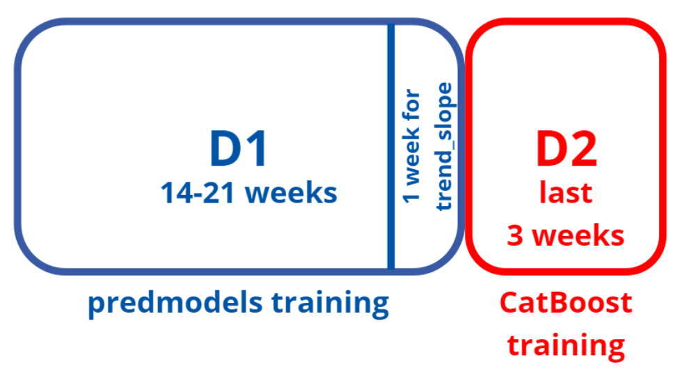
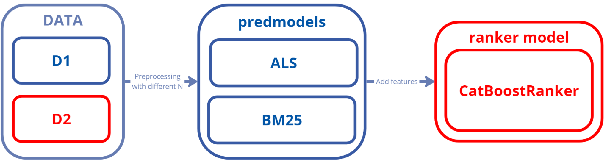

## Introduction
Комплексное решение через двухэтапную модель для предсказаний рекомендаций. На первом этапе (называемом этапом предмоделей) мы используем ансамбль моделей ALS и BM25 для отбора кандидатов и последующего ранжирования с помощью более сложной модели.

### Dataset



*d1* - датасет с данными не за последние *n_weeks_for_catboost* недель(для обучения предмоделей)\
*d2* - датасет с данными за последние *n_weeks_for_catboost* недель, (для обучения catboost)

На этапе создания признаков мы создаем целевые значения для обучения модели и дополнительные признаки на основе исторических данных и разбиваем исходный датасет на три части(при тестировании гипотез и локальной проверки и решения). Среди признаков следует выделить следующие: 
1. Угол наклона линии тренда(по каждому из дней недели)
2. Признаки на основе длительности просмотров(90 персентиль, среднее арифметическое, сумма)

Мы делаем упор на учет трендов и сезонности, что позволяет нашему решению минимизировать проблему нехватки исторических данных.

### Solution



В нашем решении используются реализации алгоритмов из библиотеки implicit, которые отличаются скоростью и возможностью распараллелить вычисления на графическом ускорителе.

В числе прочего следует отметить разделение пользователей на две группы по количеству просмотров: для одной из них будет использоваться предсказание на основе моделирования, а для другой - на основе эвристик, описанных в классе ColdStart.

Второй этап решения - использование градиентного бустинга Catboost для ранжирования кандидатов, полученных из предмоделей. Кандидатам, которые пользователь дейтсвительно посмотрел, ставим label=1, иначе 0. В качестве признаков для катбуста используем информацию о пользователе, фильме и истории их взаимодействий. Для каждого пользователя на X истинных кандидатов случайно сэмплируем по X кандидатов, которые есть только в предсказании и ALS, и BM25

Перед рекомендацией для всех пользователей мы заново обучаем предмодели на всех данных.

Обучающий датасет: [Скачать](https://cloud.gs-labs.tv/s/iagLiCtlMDXmzKf)

### Install & Start
Все решение разбито на скрипты для модернизации независимых частей решения.

```bash
git clone 
cd rec_system_2stepCatboost
pip install -r requirements.txt
```
```bash
python run_solution.py
```

Полное решение с комментариями можно найти [туть](https://github.com/Gruz2520/rec_system_2stepCatboost/blob/main/Team%20Buns.ipynb). 


Solution by **Team Buns**

